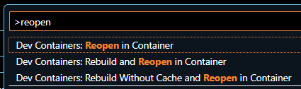

# wp-plugin-devcontainer
A simple dev container template for WordPress plugin development.

# How to use
 1. Install requirements:
    * [Visual Studio Code](https://code.visualstudio.com/)
    * [Dev Containers extension](https://marketplace.visualstudio.com/items?itemName=ms-vscode-remote.remote-containers)
    * [Docker environment](https://code.visualstudio.com/docs/devcontainers/containers#_installation) (Linux PC is recommend)

    Remote Development:

       1. Prepare Linux PC. Recommended RAM is 4GB or higher.
       2. Install requirements in your terminal PC:
          * [Remote Development Extension Pack](https://marketplace.visualstudio.com/items?itemName=ms-vscode-remote.vscode-remote-extensionpack)
       3. Configure server.
          * [Install docker](https://code.visualstudio.com/docs/devcontainers/containers#_installation:~:text=tricks%20for%20troubleshooting.-,Linux,-%3A).
          * Setup [Remote Tunnels](https://code.visualstudio.com/docs/remote/tunnels) or SSH (configure your router for forwarding ssh port).
          * Setup WoL or remote power-on method, if you need.
       4. Connect to server.
       5. Recommended: Install [Docker for Visual Studio Code](https://marketplace.visualstudio.com/items?itemName=ms-azuretools.vscode-docker) in server.

 2. Clone this repository.
 3. Open cloned folder in Visual Studio Code.
 4. mkdir `src`
 5. Edit [devcontainer-docker-compose-options.yml](devcontainer-docker-compose-options.yml), and edit [test-docker-compose-options.yml](test-docker-compose-options.yml).
 6. Run `Dev Containers: Open Folder in Container...` in Command Palette.

# Dev container settings

Dev container is inherited from [WordPress official image](https://hub.docker.com/_/wordpress).

This container execute following steps on startup:

 1. Build image. See [.devcontainer/wordpress-base.Dockerfile](.devcontainer/wordpress-base.Dockerfile).

    1. Configure user settings for www-data console operation.
    2. Configure "php.ini".
    3. Install composer.
    4. Install WP-CLI.
    5. `wp core download` like operation.
    6. Set default user as `www-data`.
    7. Set default directory as `/var/www/html`.

 2. Wait for MySQL ready.

 3. Configure `wp-config.php`.

 4. `wp core install` with environment variables.

 5. Run shell script file for WordPress first installation. Set `$WORDPRESS_SETUP_SCRIPT` environment variable.

## References
 * WordPress Image
    * [Environment variables](https://hub.docker.com/_/wordpress#:~:text=How%20to%20use%20this%20image)
    * [docker-entrypoint.sh](https://github.com/docker-library/wordpress/blob/master/docker-entrypoint.sh)
    * [wp-config-docker.php](https://github.com/docker-library/wordpress/blob/master/wp-config-docker.php)
 * [.devcontainer/devcontainer.json](.devcontainer/devcontainer.json)
 * `wordpress` service in [.devcontainer/common.yml](.devcontainer/common.yml)
 * [.devcontainer/devcontainer-docker-compose.yml](.devcontainer/devcontainer-docker-compose.yml)
 * [.devcontainer/devcontainer-created.sh](.devcontainer/devcontainer-created.sh) (call at dev container's postCreateCommand)

## Tips
 * Enter console: `Ctrl+Shift+@`
 * Forward a Ports: `Ctrl+Shift+P` (Command pallet) → `Forward a Ports`
 * Exit/Reopen/Rebuild dev container: `Ctrl+Shift+P` (Command pallet) → 
 * Run test: `Ctrl+Shift+P` (Command pallet) → `Tasks: Run Test Task`

### Xdebug
 1. Bookmark `javascript:(function() {document.cookie='XDEBUG_TRIGGER='+'VSCODE'+';path=/;';document.location.reload();setTimeout(function() {document.cookie='XDEBUG_TRIGGER='+''+';expires=Mon, 05 Jul 2000 00:00:00 GMT;path=/;';}, 100);})()`
 2. Set breakpoint.
 3. Start Xdebug: `Shift+Alt+F9` or `Run and Debug` in Left sidebar → `Listen for Xdebug`
 4. Open WordPress page that you want to debug.
 5. Open bookmarked JavaScript.

# todo: Test envinronment settings
 * [.devcontainer/run-test.sh](.devcontainer/run-test.sh)
 * [test-docker-compose-options.yml](test-docker-compose-options.yml)
 * [.devcontainer/test-docker-compose.yml](.devcontainer/test-docker-compose.yml)
 * [.devcontainer/common.yml](.devcontainer/common.yml)
